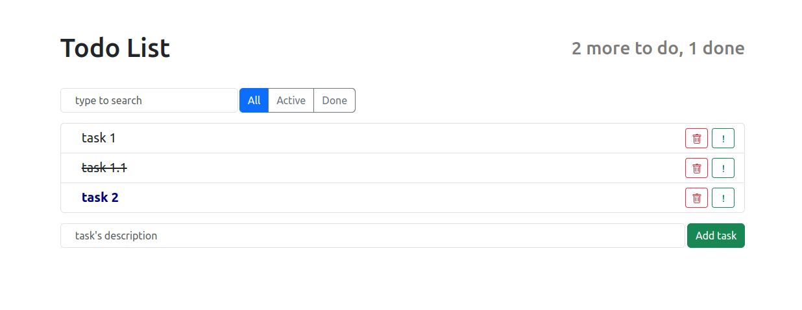
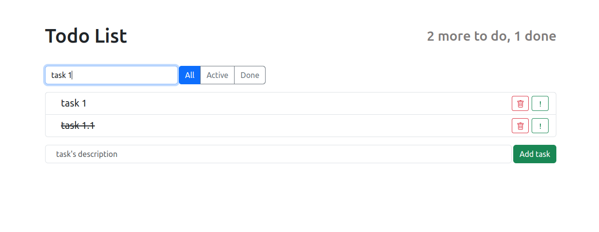
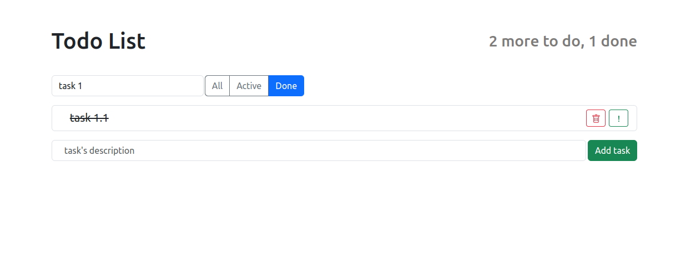

# Todo App

Проект на React JS + [Bootstrap](https://getbootstrap.com/) для сохранения и отслеживания задач.
При "ручном" развертывании для сохранения данных
требуется [submodule](https://github.com/de-brasi/todo-app-server-python/tree/master) с простым сервером на Python.

Как запустить:
```
git clone git@github.com:de-brasi/todo-app-server-python.git
git submodule update --remote
docker compose -f docker-compose.yml up
```

Интерфейс доступен через браузер по адресу [http://localhost:3000](http://localhost:3000).



